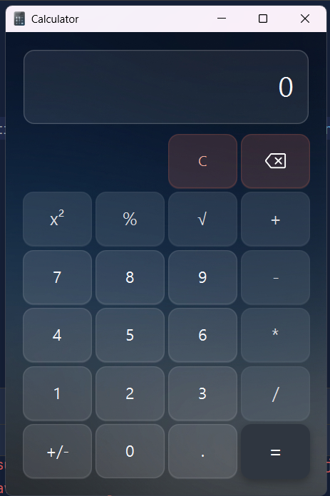
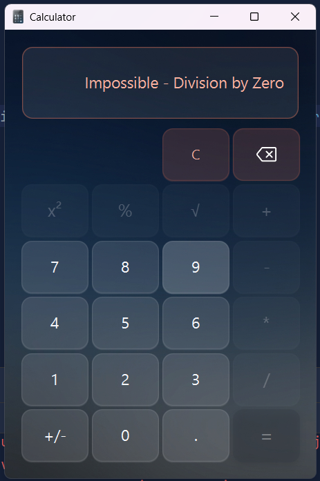
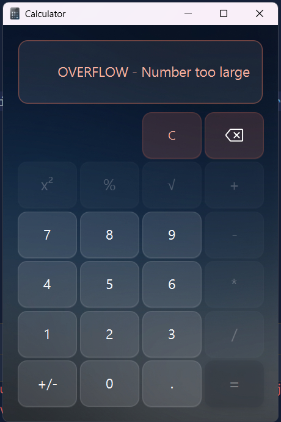
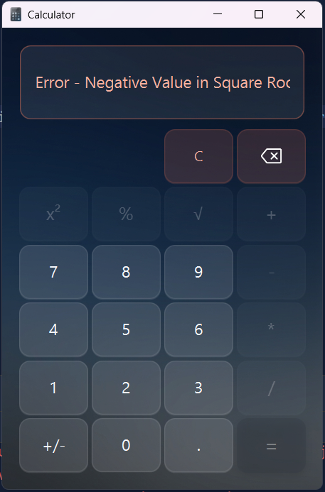

# JavaFX Smart Calculator

A high-precision, state-aware calculator built with JavaFX. This project demonstrates clean architecture by separating business logic, error handling, and UI styling.

## ✨ Features

* High Precision Calculations using `BigDecimal` to eliminate floating-point inaccuracies.
* Smart UI State Management that disables invalid operations during error states.
* CSS-Based Styling with complete separation between UI design and application logic.
* Enum-Driven Architecture for operations and error messages, improving readability and maintainability.

## 📸 Screenshots

### Main Interface



### Division by Zero Error



### Overflow Error



### Square Root Error



## 🛠 Technical Stack

* Java 17+
* JavaFX 21
* Maven

## 🚀 Getting Started

1. Clone the repository:

```bash
git clone https://github.com/axiomdevv/JavaFX-Smart-Calculator.git
```

2. Open the project in IntelliJ IDEA or Eclipse as a Maven project.
3. Run `Launcher.java`.

## 🏗 Architecture

The application follows a clean separation of concerns:

* Java handles application logic and state management.
* FXML defines the user interface structure.
* CSS manages all visual styling and interactive effects.

This approach keeps the codebase maintainable, scalable, and easy to extend.
